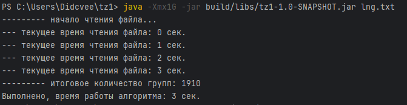
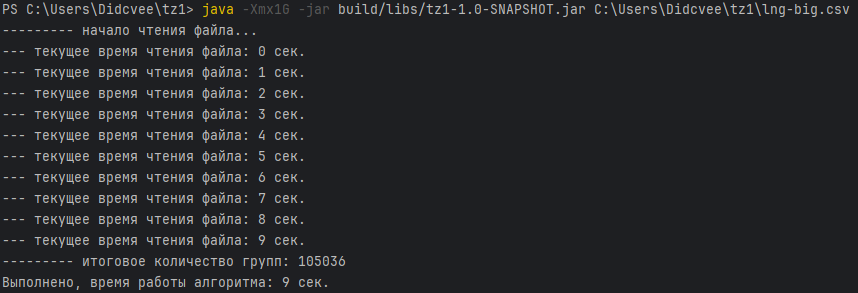

 

  

<h2 align="center">Тестовое задание</h2>

### Стек:
* Java 17
* Gradle
* JMH
### Для запуска:
1) git clone https://github.com/Didcvee/test22
2) Перейдите в корень проекта
* Выполните следующие команды в терминале:
3) .\gradlew clean build
4) java -Xmx1G -jar build/libs/tz1-1.0-SNAPSHOT.jar (ваш файл txt/csv)
### Результаты:
1) lng.txt - 3 секунды, количечтво групп - 1910

2) lng-big.csv - 9-10 секунд, количечтво групп - 105036

##### Также если развернуть в среде разработки можно выполнить бенчмарк с помощью JMH

